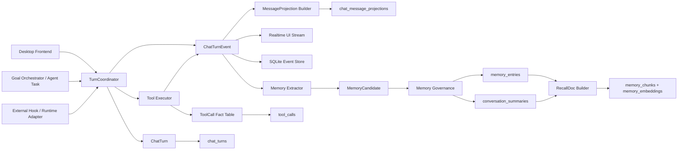
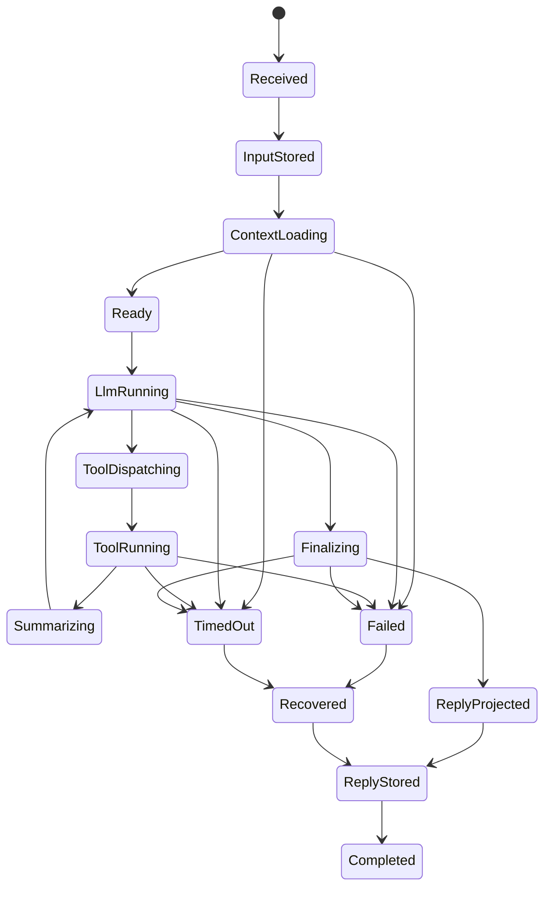
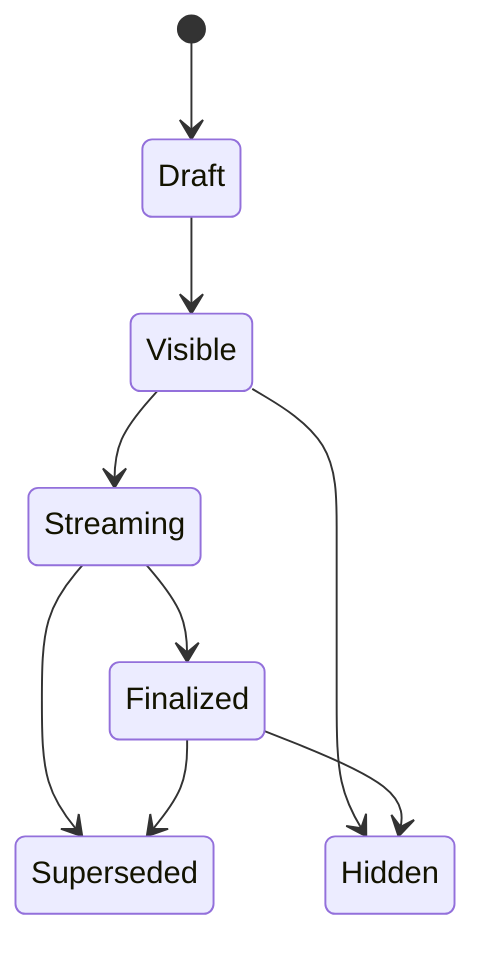
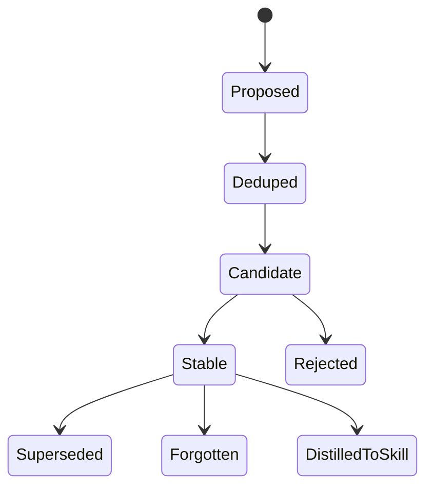

# ChatTurn 数据总线、状态机与记忆消费模型

日期：2026-06-03

关联文档：
- `docs/chat-turn-state-and-memory-design-20260603.md`
- `docs/LLM工具与多Agent执行状态机模型-20260531.md`
- `docs/运行时可观察性与Agent链路收口-20260531.md`

## 0. 2026-06-04 状态校正

本文件的目标模型仍有效。当前实现已经完成 P0/P1 的主要新写入链路：`ChatTurn` 显式化、`ChatTurnEvent` 镜像、`ToolCall.turn_id`、`MessageProjection`、`MemoryCandidate` 和 best-effort promotion。仍需把下列边界写清楚：

1. `ChatTurnEvent` 是事件总线，但当前实时 UI 仍未完全从它 replay。
2. `MessageProjection` 是前端 read model；`plain_text` 必须是用户可见文本，工具原始结果只能作为 content block / tool fact。
3. `RecallDoc` 尚未落地，当前向量库仍直接索引 memory chunk。
4. `RecallContext.session_id / goal_id` 已进入 prompt recall 调用链；`memory_entries` 已补齐来源字段，SQL 会排除显式属于其他 session / goal 的记忆，同时保留未打来源标签的全局/工作区记忆。

## 1. 结论先行

这轮建模后的强结论有四条：

1. `ChatTurn` 不应该被做成“只装 user 和 llm 输入输出的轻量总线”。
2. 真正的“数据总线”应该是 `ChatTurnEvent`，它是 append-only 事件流。
3. `ChatTurn` 应该是 turn 级规范事实对象，是事件流收敛后的 canonical aggregate。
4. 前端、SQLite、轻量向量库不应该消费同一份原始 payload，而应该分别消费：
   - 前端：`ChatTurnEvent + MessageProjection`
   - SQLite：`ChatTurn + ChatTurnEvent + ToolCall + Projection`
   - 向量检索：`RecallDoc`，而不是原始 `ChatTurn`

换句话说：

- `ChatTurn` 不是 bus。
- `ChatTurn` 也不能只含 user/llm 两端文本。
- `ChatTurnEvent` 才是 bus。
- `MessageProjection`、`MemoryCandidate`、`RecallDoc` 是不同消费面的投影。

## 2. 为什么不能把 ChatTurn 缩成“只含 user 和 llm 输入”

如果把 `ChatTurn` 定义成：

- 用户输入
- LLM 输入上下文
- LLM 输出文本

那么会立刻丢掉四类关键真相：

1. 执行真相
   - `request_id`
   - 当前 phase
   - tool round 次数
   - timeout / recovery / forced final answer

2. 工具真相
   - 哪个 tool call 成功
   - 哪个 tool call 失败
   - 哪个结果进入了最终回答
   - 哪个结果需要审批

3. 投影真相
   - 前端显示过哪些中间态
   - 哪条 assistant 消息是 streaming draft
   - 哪条 message 被 supersede

4. 记忆真相
   - 哪段结论被抽成 memory candidate
   - 哪些 tool 结果提供了证据
   - 哪条记忆来自哪个 turn/message/tool
   - 哪个后续 turn 修正了旧记忆

因此更合理的拆分是：

- `ChatTurn`：一轮请求的规范事实对象
- `ChatTurnEvent`：这一轮请求的事件总线
- `MessageProjection`：给 UI 的消息视图
- `MemoryCandidate`：从 turn 中抽出的待治理记忆
- `RecallDoc`：给召回和向量检索用的稳定文档

## 3. 目标模型

### 3.1 核心实体

```rust
pub struct ChatSessionRecord {
    pub id: String,
    pub workspace_id: Option<String>,
    pub title: String,
    pub session_kind: String,
    pub goal_id: Option<String>,
    pub archived: bool,
    pub created_at: DateTime<Utc>,
    pub updated_at: DateTime<Utc>,
    pub metadata: serde_json::Value,
}

pub struct ChatTurnRecord {
    pub id: String,
    pub session_id: String,
    pub workspace_id: Option<String>,
    pub request_id: String,
    pub initiator_kind: String,
    pub goal_id: Option<String>,
    pub task_id: Option<String>,
    pub parent_turn_id: Option<String>,
    pub user_message_projection_id: Option<String>,
    pub assistant_message_projection_id: Option<String>,
    pub model_provider: String,
    pub model_name: String,
    pub task_mode: String,
    pub capability: String,
    pub status: String,
    pub stage: Option<String>,
    pub llm_round_count: u32,
    pub tool_run_count: u32,
    pub active_tool_count: u32,
    pub memory_status: String,
    pub projection_status: String,
    pub started_at: DateTime<Utc>,
    pub finished_at: Option<DateTime<Utc>>,
    pub error: Option<String>,
    pub metadata_json: serde_json::Value,
}

pub struct ChatTurnEventRecord {
    pub id: String,
    pub turn_id: String,
    pub session_id: String,
    pub workspace_id: Option<String>,
    pub request_id: String,
    pub seq: i64,
    pub event_type: String,
    pub phase: Option<String>,
    pub actor_kind: String,
    pub actor_id: Option<String>,
    pub causation_id: Option<String>,
    pub correlation_id: Option<String>,
    pub payload_json: serde_json::Value,
    pub created_at: DateTime<Utc>,
}

pub struct MessageProjectionRecord {
    pub id: String,
    pub turn_id: String,
    pub session_id: String,
    pub role: String,
    pub projection_kind: String,
    pub status: String,
    pub visibility: String,
    pub plain_text: Option<String>,
    pub content_blocks_json: serde_json::Value,
    pub source_event_id: Option<String>,
    pub seq: i64,
    pub created_at: DateTime<Utc>,
    pub updated_at: DateTime<Utc>,
}

pub struct MemoryCandidateRecord {
    pub id: String,
    pub turn_id: String,
    pub session_id: String,
    pub workspace_id: Option<String>,
    pub source_message_projection_id: Option<String>,
    pub source_tool_call_id: Option<String>,
    pub memory_kind: String,
    pub scope_kind: String,
    pub scope_ref: Option<String>,
    pub path_prefix: Option<String>,
    pub key: String,
    pub value_json: serde_json::Value,
    pub summary: String,
    pub evidence_json: serde_json::Value,
    pub extractor_kind: String,
    pub extractor_provider: Option<String>,
    pub extractor_model: Option<String>,
    pub confidence: f64,
    pub status: String,
    pub dedupe_key: String,
    pub promoted_memory_entry_id: Option<String>,
    pub created_at: DateTime<Utc>,
    pub updated_at: DateTime<Utc>,
}

pub struct RecallDocRecord {
    pub id: String,
    pub source_kind: String,
    pub source_id: String,
    pub workspace_id: Option<String>,
    pub scope_kind: String,
    pub scope_ref: Option<String>,
    pub path_prefix: Option<String>,
    pub title: String,
    pub body: String,
    pub keywords_json: serde_json::Value,
    pub freshness_score: f64,
    pub status: String,
    pub created_at: DateTime<Utc>,
    pub updated_at: DateTime<Utc>,
}
```

### 3.2 每个实体的职责

| 实体 | 职责 | 不能承担什么 |
|---|---|---|
| `ChatSession` | 会话容器、工作区归属、goal 关联 | 不承担一轮执行明细 |
| `ChatTurn` | 一轮请求的规范事实对象 | 不做实时增量传输 |
| `ChatTurnEvent` | turn 内增量事件总线 | 不做最终 UI 呈现 |
| `MessageProjection` | 前端消息时间线和恢复视图 | 不做记忆治理主表 |
| `ToolCall` | 工具执行事实表 | 不做 turn 汇总 |
| `MemoryCandidate` | 从 turn 抽出的待治理记忆 | 不直接作为长期记忆最终态 |
| `MemoryEntry` | 被治理后的持久记忆 | 不承载流式中间态 |
| `RecallDoc` | 可召回、可嵌入、可搜索文档 | 不承载全部原始 turn 细节 |

## 4. 整条线的接入和消费拓扑

### 4.1 生产者与消费者



### 4.2 接入点定义

| 接入方 | 接入对象 | 怎么接入 |
|---|---|---|
| 前端发送消息 | `TurnCoordinator` | 创建 `ChatTurn`，立刻追加 `turn.received` |
| `send_v2` LLM 循环 | `ChatTurnEvent` | 每个阶段、delta、tool request 都发 event |
| 工具执行器 | `ToolCall + ChatTurnEvent` | 工具落事实表，同时回写 `tool.*` 事件 |
| 自动摘要 | `MemoryCandidate / Summary` | 不再直接只写 summary，改为 turn 完成后的异步消费器 |
| Goal/Task 触发聊天 | `TurnCoordinator` | 以 `initiator_kind=goal_task` 创建 turn |
| 外部 runtime/hook | `ChatTurnEvent` 或 `runtime_events` bridge | 用 correlation id 归并到 turn |

### 4.3 消费边界

| 消费方 | 消费对象 | 为什么 |
|---|---|---|
| 前端实时态 | `ChatTurnEvent` | 需要流式阶段、thinking、tool progress |
| 前端恢复态 | `MessageProjection` | 刷新页面后要稳定恢复消息时间线 |
| 会话侧边栏 | `ChatTurn + active projection` | 只需要 working/status/counts |
| SQLite | `ChatTurn/ChatTurnEvent/Projection/ToolCall` | 要保留规范事实与审计链路 |
| 记忆抽取 | `ChatTurn completed + MessageProjection + ToolCall` | 需要完整证据 |
| 向量检索 | `RecallDoc` | 只应消费稳定、归一化、可检索文档 |

## 5. ChatTurn 生命周期状态机

### 5.1 Turn 状态机



### 5.2 状态解释

| 状态 | 含义 |
|---|---|
| `received` | turn 已创建，但用户输入尚未落地 |
| `input_stored` | 用户输入投影已持久化 |
| `context_loading` | 正在加载消息、workspace、memory、tools |
| `ready` | 调 LLM 前的就绪态 |
| `llm_running` | 模型正在生成文本、thinking 或 tool request |
| `tool_dispatching` | 已收到 tool call，正在准备执行 |
| `tool_running` | 至少一个工具执行中 |
| `summarizing` | 工具结果已回收，正在整理给下一轮 LLM |
| `finalizing` | 正在强制 final answer、fallback 或 recovery |
| `reply_projected` | 已形成 assistant 投影，但尚未最终落库 |
| `reply_stored` | assistant 可见消息已持久化 |
| `completed` | turn 结束 |
| `failed` | turn 失败，未恢复 |
| `timed_out` | turn 超时，未恢复 |
| `recovered` | 用 fallback 或 recovery 产出了可审阅结果 |

### 5.3 当前代码如何映射到目标状态机

当前已有事实可以直接映射：

- `request_id`：来自 `send_v2`
- `phase/tool_run_count/active_tool_count`：当前在 `active_run`
- `v2_stage`：当前由 `append_chat_stage()` 写事件
- `tool_calls`：当前已是成熟事实表
- `thinking-update/tool-execution-update`：当前已经是准事件流

因此第一步不是重写链路，而是把这些散落字段收敛到：

- `chat_turns`
- `chat_turn_events`
- `tool_calls.turn_id`

`active_run` 则降级成内存缓存，不再是唯一真相源。

## 6. ChatTurnEvent 事件总线模型

### 6.1 事件类别

推荐统一成以下事件命名：

| 类别 | 事件 |
|---|---|
| turn | `turn.received` `turn.input_stored` `turn.context_loaded` `turn.completed` `turn.failed` `turn.timed_out` `turn.recovered` |
| llm | `llm.round_started` `llm.delta_emitted` `llm.thinking_emitted` `llm.tool_calls_requested` `llm.final_text_emitted` |
| tool | `tool.call_queued` `tool.call_started` `tool.call_succeeded` `tool.call_failed` `tool.call_approval_required` |
| projection | `projection.user_visible` `projection.assistant_streaming` `projection.assistant_finalized` `projection.superseded` |
| memory | `memory.extraction_started` `memory.candidate_emitted` `memory.entry_promoted` `memory.entry_superseded` |
| summary | `summary.generated` `summary.stored` |

### 6.2 事件不变量

每条 `ChatTurnEvent` 都必须有：

- `turn_id`
- `session_id`
- `request_id`
- `seq`
- `event_type`
- `created_at`

推荐尽量也有：

- `workspace_id`
- `actor_kind`
- `causation_id`
- `correlation_id`

这样才能做：

- 审计
- 重放
- 跨系统归因
- tool 到 memory 的证据追踪

### 6.3 和 `runtime_events` 的关系

建议关系不是二选一，而是分层：

1. `runtime_events`
   - 保留为跨域统一运行时日志
   - 服务 chat / goal / agent / hook 等多个域

2. `chat_turn_events`
   - 专门服务聊天 turn 的细粒度重放与投影
   - 是 chat 域内的专用 event bus

推荐做法：

- `chat_turn_events` 是 chat 域事实流
- 关键里程碑 mirror 到 `runtime_events`
- `runtime_events.subject_type = chat_turn`
- `runtime_events.subject_id = turn_id`

## 7. MessageProjection 状态机



### 7.1 为什么要单独做投影

因为前端关心的不是规范事实，而是：

- 这条消息现在能不能展示
- 是不是 streaming
- 最终文案是不是已经稳定
- 中间态是否应该替换掉

所以 `chat_messages` 更适合作为 projection，而不是主规范实体。

下一轮建议：

- 保留 `chat_messages` 兼容旧读路径
- 新增 `chat_message_projections`
- 逐步把前端读取迁到 projection 表

## 8. MemoryCandidate 到 RecallDoc 的状态机

### 8.1 记忆候选状态机



### 8.2 记忆分层

推荐分成四层：

1. `MemoryCandidate`
   - 从 turn 中抽出的待治理候选
   - 可能来自 LLM、规则、工具结果

2. `MemoryEntry`
   - 被治理后的持久记忆
   - 有 scope、confidence、sensitivity、status

3. `ConversationSummary`
   - 对长对话片段的摘要记忆
   - 不替代结构化记忆

4. `RecallDoc`
   - 为检索而准备的文档化对象
   - 由 stable memory、summary、稳定结论生成

### 8.3 为什么向量库不应直接吃 ChatTurn

原始 turn 有三个问题：

1. 噪声高
   - thinking、tool trace、fallback、重复上下文都混在一起

2. 证据粒度不合适
   - 检索真正需要的是稳定结论，不是全过程转储

3. 难治理
   - 记忆一旦被修正，直接吃 raw turn 的索引很难撤回

因此向量索引应该吃 `RecallDoc`，而 `RecallDoc` 来自：

- stable `MemoryEntry`
- `ConversationSummary`
- 被标记为可复用的稳定结论

## 9. 长期记忆的粒度设计

### 9.1 是否要落到项目/路径层

结论：要，但不是只做“项目层”或只做“路径层”，而是做分层 scope。

推荐 scope：

- `global`
- `workspace`
- `path_prefix`
- `file`
- `session`

推荐默认策略：

1. 用户偏好、身份信息
   - `global`

2. 项目约定、repo 内术语、工作区编码习惯
   - `workspace`

3. `src/chat/*`、`apps/desktop/*` 这种目录局部约定
   - `path_prefix`

4. 单文件特殊规则
   - `file`

5. 本轮对话临时约定
   - `session`

也就是说：

- 长期记忆的默认沉淀层应该是 `workspace`
- 只有证据明确指向某个子树时才下钻到 `path_prefix`

### 9.2 建议的数据表达

```rust
pub struct MemoryScopeRef {
    pub scope_kind: String,      // global/workspace/path_prefix/file/session
    pub scope_ref: Option<String>, // workspace_id, file_id, session_id ...
    pub path_prefix: Option<String>, // "crates/conductor-core/src/chat"
}
```

这样一个记忆既可以：

- 属于某个 workspace
- 又只在某个 path prefix 下生效

## 10. 长期记忆能否蒸馏成 skill

结论：可以，但不能把“一次 turn 的提炼结果”直接当 skill。

skill 不是普通 memory entry，而是：

- 稳定
- 可执行
- 有边界
- 可复用
- 最好有人审过

推荐蒸馏链路：

```text
MemoryCandidate
  -> Stable MemoryEntry
  -> Repeated Pattern
  -> SkillCandidate
  -> Human Review
  -> Published Skill
```

适合蒸馏成 skill 的内容：

- 某 repo 一直重复的修复流程
- 某路径的测试/构建套路
- 某类文档操作步骤
- 某类 Lark / Office / CLI 工作流

不适合直接蒸馏的内容：

- 单次任务结论
- 时效很强的上下文
- 未验证的 LLM 推断
- 强依赖个人偏好的临时表达

因此要新增一个中间态：

- `skill_candidate`

它不是 memory 的替代，而是 memory 的高阶产物。

## 11. 不同 LLM 塞入的记忆碎片会不会不同

结论：一定会不同，所以必须把“提取器来源”做成一等字段。

不同模型会在三个层面出现差异：

1. 抽取倾向不同
   - 有的更偏事实
   - 有的更偏总结
   - 有的会过度泛化

2. 证据压缩不同
   - 有的会把 tool result 压得太短
   - 有的会保留更多上下文

3. 边界判断不同
   - 什么算偏好
   - 什么算 repo 约定
   - 什么算可长期沉淀的知识

所以 `MemoryCandidate` 需要记录：

- `extractor_kind`: `llm | rule | tool`
- `extractor_provider`
- `extractor_model`
- `prompt_version` 或 policy version
- `source_event_ids`

推荐治理规则：

1. `user_confirmed` 最高优先级
2. `tool_verified` 高于 `llm_inferred`
3. 多模型一致可提高 confidence
4. 相互冲突的候选先并存，再由治理层 supersede

## 12. 当前持久化记忆是怎么实现的

当前实现已经有四张主表：

1. `memory_entries`
   - 主记忆表
   - 字段包括 `scope / workspace_id / source / confidence / sensitivity / status`

2. `conversation_summaries`
   - 长对话摘要表

3. `memory_chunks`
   - 为检索切出来的 chunk

4. `memory_embeddings`
   - chunk 对应的 embedding

当前链路是：

1. prompt 构建时调用 `recall_for_prompt(user_message, None, 5)`
2. 这会从 `memory_entries + conversation_summaries` 召回内容
3. 自动摘要通过 `maybe_auto_summarize()` 在阈值命中后写 `conversation_summaries`
4. `memory_entries` 写入后会 write-through 到 `memory_chunks + memory_embeddings`

当前问题收敛为三个：

1. 低层 `set/add memory` 默认仍偏 `global + workspace_id=None`，需要由上游 scope 决策约束。
2. 自动摘要只生成 summary，没有完整接入治理层。
3. 向量索引还没有建立在“稳定 recall doc”这一层。

所以当前记忆是“能存、能召回、能索引”，但还不是“turn 驱动、可治理、可蒸馏”的体系。

## 13. 从当前代码到目标模型的迁移顺序

### P0：把 turn 显式化

1. 新增 `chat_turns`
2. 新增 `chat_turn_events`
3. `send_v2` 创建 turn，并把 `request_id` 固定归属到 `turn_id`
4. `active_run` 改成 turn 的内存 cache，而不是事实源

### P1：把工具事实挂到 turn

1. 给 `tool_calls` 增加 `turn_id`
2. tool 生命周期同时发 `tool.*` 事件
3. `reply_stored` 事件记录最终 assistant projection id

### P2：把消息降级成 projection

1. 新增 `chat_message_projections`
2. 从 `ChatTurnEvent` 构建 UI 消息投影
3. 旧 `chat_messages` 继续兼容，逐步收口

### P3：把记忆接到 turn 完成事件

1. `turn.completed` 后触发 memory extractor
2. 先生成 `MemoryCandidate`
3. 治理后再写 `MemoryEntry`
4. `ConversationSummary` 只是 recall source 之一，不再是唯一副产物

### P4：把向量索引改成 RecallDoc 驱动

1. `MemoryEntry/ConversationSummary` 生成 `RecallDoc`
2. 向量层只索引 `RecallDoc`
3. recall 时按 scope 和 path_prefix 过滤

### P5：做 skill 蒸馏

1. 统计 repeated stable memories
2. 生成 `skill_candidate`
3. 经过 review 再发布 skill

## 14. 对这轮问题的直接回答

如果问题是：

“ChatTurn 要不要做成只含 user 和 llm 两端输入、然后被前端投影、sqlite、轻量向量库共同消费的数据总线？”

直接回答是：

不建议。

更合理的定义是：

1. `ChatTurn`
   - 做规范事实对象
   - 至少包含 turn 级执行元数据、消息引用、工具计数、状态和记忆状态

2. `ChatTurnEvent`
   - 做真正的数据总线
   - 负责前端流式、运行态观察、事件审计、异步消费者解耦

3. `MessageProjection`
   - 给前端 timeline 和重载恢复

4. `RecallDoc`
   - 给轻量向量库

所以最稳的架构不是“一个 ChatTurn 喂所有人”，而是：

```text
ChatTurnEvent 负责流
ChatTurn 负责真相
MessageProjection 负责前端
RecallDoc 负责检索
```

这才是下一轮最合理的数据总线模型。
