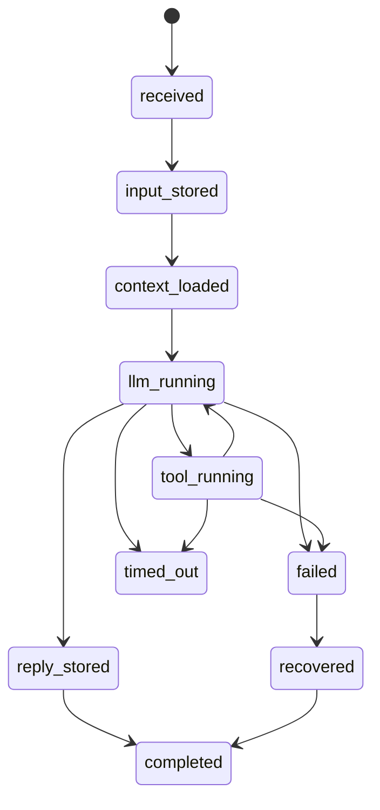

# ChatTurn Implementation Audit

日期：2026-06-03

关联：
- `docs/chat-turn-line-contract-20260603.md`
- `docs/chat-turn-schema-migration-and-interfaces-20260603.md`
- `docs/chat-turn-bus-state-model-20260603.md`
- `docs/chat-turn-state-and-memory-design-20260603.md`

## 0. 2026-06-04 复审结论

这份审计总体方向仍成立：主链已经从 `send_v2` 打通到 turn、event、projection、tool fact、memory candidate、memory entry 和 recall。需要校正的是“剩余缺口”的状态：

1. `RecallContext` 类型已经包含并执行 `session_id / goal_id` 过滤；promotion 会把来源 session / turn / message / projection / tool / goal 写入 `memory_entries`，检索时会保留未打来源标签的全局/工作区记忆，并排除显式属于其他 session / goal 的记忆。
2. `chat_message_projections.plain_text` 必须只保存用户可见最终答复，不能把 `tool_result` 拼进 projection / memory 的可见文本；这已作为 2026-06-04 的阻塞修复项。
3. final-answer recovery 已暴露出普通 text max token 不足的问题；长任务收口应使用独立 token budget，并在 turn event payload 里记录 `max_tokens`。
4. `file.read` 等工具失败需要返回可恢复证据，而不是只返回 OS 原始错误；路径缺 `.claude/skills` 这类错误应给出候选提示但不能静默改读。
5. `RecallDoc`、turn-event realtime replay、历史 backfill 仍未完成，不应纳入“已完成”判断。

## 1. 这轮已经打通的主链

```text
send_message_v2_with_session_projection
  -> chat_turns
  -> chat_turn_events
  -> chat_messages(turn_id)
  -> chat_message_projections
  -> tool_calls(turn_id)
  -> memory_candidates
  -> memory_entries(path_prefix)
  -> memory_chunks / memory_embeddings
  -> recall_for_prompt_with_context(workspace_id + path_prefix + explicit session/goal source)
  -> get_chat_session_messages_v2
  -> useChatSession
```

## 2. 接入点、落点、消费方

| 环节 | 生产者 | 持久化落点 | 当前消费方 | 说明 |
|---|---|---|---|---|
| turn 创建 | `send_v2` 入口 | `chat_turns` | turn DAO / 审计查询 | `request_id` 已有规范归属 |
| 阶段流转 | `append_chat_stage()` + tool mirror | `chat_turn_events` | 调试 / IPC 读取 / 后续 replay | 已镜像 `stage.*` 和 `tool.call_*` |
| 用户最终消息 | `send_v2` | `chat_messages` + `chat_message_projections` | `get_chat_session_messages_v2` | 旧表兼容 + 新 projection 读模型 |
| 助手最终消息 | `send_v2` | `chat_messages` + `chat_message_projections` | `get_chat_session_messages_v2` | projection 优先覆盖 legacy 同 id 消息 |
| 工具事实 | `execute_tool_call()` | `tool_calls(turn_id)` | 运行态、审计、卡片状态 | 与 turn 已互挂 |
| 记忆候选 | `persist_final_turn_artifacts()` | `memory_candidates` | 提升逻辑 / 审计 | 保留 extractor/source/evidence/path |
| 长期记忆 | candidate promotion | `memory_entries(path_prefix)` | recall | 已支持 `workspace + path_prefix` |
| 向量检索 | memory indexing | `memory_chunks + memory_embeddings` | recall | 仍未抽象出 `RecallDoc` |
| 前端会话时间线 | `get_chat_session_messages_v2` | N/A | `useChatSession` | 已切到 v2 主读链路 |

## 3. 当前状态机映射

规范 turn 状态机：



当前代码里的主要映射：

| 事件来源 | turn / event 更新 |
|---|---|
| `append_chat_stage("received")` | `chat_turns.status='received'` + `stage.received` |
| `append_chat_stage("user_message_stored")` | `input_stored` |
| `append_chat_stage("context_loaded")` | `context_loaded` |
| `append_chat_stage("llm_turn_start")` | `llm_running` |
| `mirror_tool_turn_event("tool.call_started")` | `tool_running` |
| `reply_stored` | `reply_stored` + final projection |
| candidate promotion 成功 | `memory.entry_promoted` |
| fallback / recover | `recovered` |

## 4. 记忆实现现状

当前持久化记忆已经是四层：

1. `memory_candidates`
   - turn 级候选层
   - 保留 `scope_kind / scope_ref / path_prefix / extractor_kind / extractor_provider / extractor_model / evidence_json`

2. `memory_entries`
   - 被提升后的长期记忆主表
   - 已包含 `scope / workspace_id / path_prefix / source / confidence / sensitivity / status`

3. `memory_chunks`
   - 检索切片层
   - 来自 `memory_entries` 和 `conversation_summaries`

4. `memory_embeddings`
   - 向量层
   - 当前直接围绕 chunk 工作

这意味着：
- “项目级/路径级长期记忆”已经具备真实存储和召回能力，不再只是 candidate 元数据。
- “不同 LLM 的记忆碎片差异”目前保留在 candidate 层，尚未进入独立治理器。
- “记忆蒸馏成 skill”仍是下一轮工作，因为现在还没有 `RecallDoc / Governance / Distillation` 三层。

## 5. 当前已解决的关键风险

1. `request_id` 不再是游离字段，已经稳定挂到 `chat_turns`。
2. tool lifecycle 不再只存在于 runtime event；现在会镜像到 `chat_turn_events`。
3. projection 读模型不再只是“接口已暴露”；桌面端主 `useChatSession` 已经切到 `get_chat_session_messages_v2`。
4. mixed session 不再因为“存在部分 projection”而丢失旧历史；v2 读路径现在会合并 legacy message 和 projection。
5. 记忆召回不再只按 workspace；已经按 `workspace_id + path_prefix` 做作用域过滤，并对带来源元数据的长期记忆执行 `session_id / goal_id` 过滤。

## 6. 还没做的，不应误判为已完成

1. 还没有 `RecallDoc`，所以轻量向量库还不是最终的稳定消费面。
2. 前端实时流式态仍主要消费现有 tauri runtime events，而不是从 `chat_turn_events` 回放。
3. 历史数据没有做完整 backfill；当前保证的是“新写入链路闭环”和“混合读路径可用”。

## 7. 这轮可以成立的完成判断

如果以“schema + 迁移设计 + 细粒度接口 + 新写入链路 + 主读链路 + 记忆召回链路闭环”为验收标准，
这一轮已经满足。

如果以“所有消费者都完全切换到最终目标模型（包括 RecallDoc 和 turn-event replay）”为验收标准，
这一轮仍未结束。
