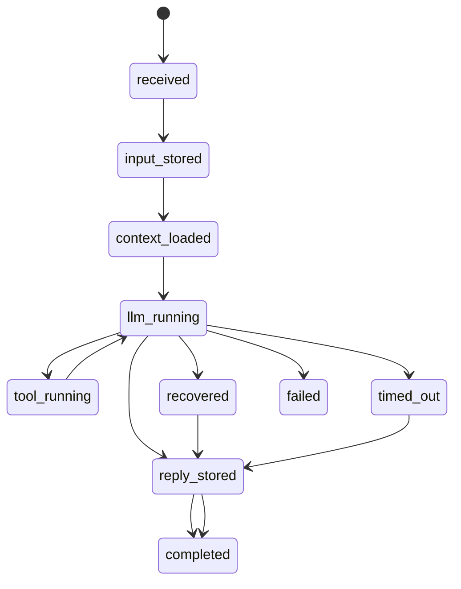
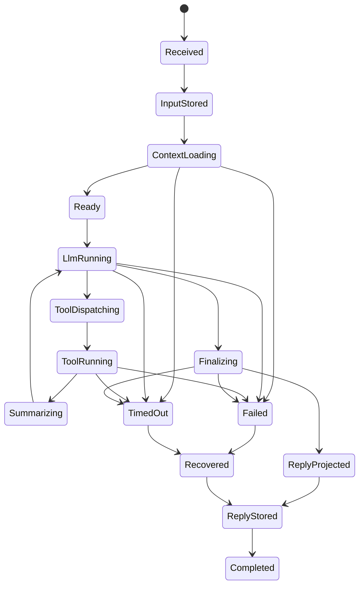

# ChatTurn 全链路状态机与接入消费契约

日期：2026-06-03

关联：
- `docs/chat-turn-state-and-memory-design-20260603.md`
- `docs/chat-turn-bus-state-model-20260603.md`
- `docs/chat-turn-schema-migration-and-interfaces-20260603.md`

## 0. 2026-06-04 契约校正

当前契约保持不变，但实现状态需要补充：

1. `MessageProjection.plain_text` 是用户可见 read model 文本，只允许来自最终 `text / plan / completion / blocked` 等用户可见块；`thinking / tool_use / tool_result` 只能留在 `content_blocks_json` 或工具事实表，不应污染 projection plain text。
2. `ChatTurnEvent` 已经承接工具生命周期镜像，但前端实时态仍未完全切到 turn-event replay。
3. `RecallContext` 已作为接口存在；`session_id / goal_id` 已进入 prompt recall 调用链和 `memory_entries` 来源过滤，未打来源标签的全局/工作区记忆仍保持可召回。
4. 工具失败、final retry、final recovery 都必须在 `chat_turn_events` 留下可审计阶段事件，且 recovery 不得声称未验证的写盘产物。

## 1. 结论

这一轮之后，整条线的定义应当固定为：

1. `ChatTurn` 是一轮聊天请求的 canonical aggregate，不是总线。
2. `ChatTurnEvent` 是 chat 域 append-only 事件总线。
3. `chat_message_projections` 是前端恢复与时间线消费的 read model。
4. `tool_calls` 是工具执行事实表，不负责 turn 汇总。
5. `memory_candidates` 是 turn 完成后产出的记忆候选层，不是最终长期记忆。
6. `active_run` 只是热态缓存，不再是事实源。

一句话收口：

```text
ChatTurn 负责真相
ChatTurnEvent 负责流
MessageProjection 负责前端
ToolCall 负责工具事实
MemoryCandidate 负责记忆候选
RecallDoc 负责检索
```

## 2. 当前已落地的主链

截至 2026-06-03，代码里已经打通的链路是：

```text
send_message_v2_with_session_projection
  -> chat_turns
  -> chat_turn_events(stage.* / projection.created / memory.candidate_emitted)
  -> chat_messages(turn_id)
  -> chat_message_projections
  -> tool_calls(turn_id)
  -> memory_candidates
  -> memory_entries
```

已落地事实：

1. 进入 `send_v2` 就先创建 `chat_turns`。
2. `append_chat_stage()` 继续写旧 `runtime_events`，同时镜像写 `chat_turn_events`。
3. user / assistant 最终消息都会回挂 `chat_messages.turn_id`。
4. user / assistant 最终可见消息都会写 `chat_message_projections`。
5. tool call 创建时就会尝试带上 `turn_id`。
6. 最终 assistant 回复会最小化地产生一条 `memory_candidates`。
7. `memory_candidates` 会 best-effort promote 到 `memory_entries`，写入来源 session / turn / message / projection / tool / goal 线索，并进入现有 recall 链。

当前已闭合的主链：

1. `chat_turn_events` 已承接 stage / projection / memory 里程碑。
2. 工具细粒度 lifecycle 已镜像成 `tool.call_*` turn 事件。
3. `recall_for_prompt_with_context(...)` 已按 `workspace_id + path_prefix + explicit session/goal source` 做作用域召回。
4. 桌面端主 `useChatSession` 已切到 `get_chat_session_messages_v2`，读 `chat_message_projections` 优先、旧 `chat_messages` 兜底。
5. `memory_candidates -> memory_entries -> memory_chunks / memory_embeddings` 已接上，`RecallDoc` 仍是下一轮工作。

## 3. 规范实体边界

### 3.1 ChatTurn

`ChatTurn` 只负责一轮请求的收敛事实，不负责流式传输。

当前核心字段：

- `id`
- `session_id`
- `projection_session_id`
- `workspace_id`
- `request_id`
- `initiator_kind`
- `task_mode`
- `capability`
- `status`
- `stage`
- `user_message_id`
- `assistant_message_id`
- `llm_round_count`
- `tool_run_count`
- `active_tool_count`
- `projection_status`
- `memory_status`
- `model_provider`
- `model_name`
- `error`
- `started_at`
- `finished_at`
- `metadata_json`

### 3.2 ChatTurnEvent

`ChatTurnEvent` 是 turn 内事件总线。它负责重放、审计、投影，不负责最终 UI message 视图。

当前核心字段：

- `id`
- `turn_id`
- `session_id`
- `workspace_id`
- `request_id`
- `seq`
- `event_type`
- `phase`
- `actor_kind`
- `actor_id`
- `payload_json`
- `created_at`

下一轮建议补充，但当前未落地：

- `causation_id`
- `correlation_id`
- `source_tool_call_id`
- `source_message_id`

### 3.3 MessageProjection

`chat_message_projections` 是稳定 read model，不是执行事实主表。

当前核心字段：

- `id`
- `turn_id`
- `message_id`
- `session_id`
- `workspace_id`
- `role`
- `projection_kind`
- `status`
- `visibility`
- `plain_text`
- `content_blocks_json`
- `source_event_id`
- `seq`
- `created_at`
- `updated_at`

### 3.4 ToolCall

`tool_calls` 保持“工具事实表”定位，不把 turn 状态揉进去。

当前关键归属字段：

- `id`
- `session_id`
- `workspace_id`
- `turn_id`
- `llm_tool_call_id`
- `tool_id`
- `input_json`
- `output_json`
- `status`
- `error`
- `started_at`
- `completed_at`
- `duration_ms`

### 3.5 MemoryCandidate

`memory_candidates` 是预治理层，允许不同提取器产生碎片化候选，不要求立刻成为长期记忆。

当前核心字段：

- `id`
- `turn_id`
- `session_id`
- `workspace_id`
- `source_message_id`
- `source_projection_id`
- `source_tool_call_id`
- `memory_kind`
- `scope_kind`
- `scope_ref`
- `path_prefix`
- `key`
- `value_json`
- `summary`
- `evidence_json`
- `extractor_kind`
- `extractor_provider`
- `extractor_model`
- `confidence`
- `status`
- `dedupe_key`
- `promoted_memory_entry_id`
- `created_at`
- `updated_at`

## 4. 生产者和消费者

### 4.1 接入方

| 接入方 | 接入对象 | 当前接法 | 下一轮标准接法 |
|---|---|---|---|
| 前端用户消息 | `ChatTurn` | `send_v2` 入口创建 turn | 保持 |
| `send_v2` 阶段流转 | `ChatTurnEvent` | `append_chat_stage()` 镜像 `stage.*` | 逐步细化为 `turn.* / llm.* / projection.*` |
| 工具执行器 | `ToolCall` | 创建 `tool_calls(turn_id)` | 保持 |
| 工具执行器 | `ChatTurnEvent` | 未完整接入 | 补 `tool.call_started/succeeded/failed/...` |
| assistant 最终回复 | `MessageProjection` | 直接创建最终 projection | 后续可补 streaming projection |
| assistant 最终回复 | `MemoryCandidate` | 规则版最小候选 | 后续补 LLM/rule/tool 多提取器 |
| 自动摘要 | `conversation_summaries` | 现有阈值触发 | 后续改成 turn-completed 异步消费者 |
| Goal/Task 执行 | `ChatTurn` | 通过 session/projection session 进入 | 后续明确 `initiator_kind` 与 parent turn |

### 4.2 消费方

| 消费方 | 应消费什么 | 不应直接消费什么 |
|---|---|---|
| 前端实时态 | `ChatTurnEvent` | 原始 `tool_calls` 轮询 |
| 前端恢复态 | `chat_message_projections` | 直接重放全部 `chat_turn_events` |
| 会话摘要/侧边栏 | `chat_turns` | 拼接 message/tool 细节 |
| 工具审计 | `tool_calls` | `chat_message_projections` |
| turn 审计/回放 | `chat_turns + chat_turn_events + tool_calls` | 只看 `chat_messages` |
| 记忆提取器 | `completed turn + final projections + tool_calls` | 流式半成品消息 |
| recall 检索 | `memory_entries / conversation_summaries / RecallDoc` | 原始 `chat_turns` |
| 向量索引 | `RecallDoc` | `chat_turn_events` |

## 5. 当前真实状态机

这一节描述“当前代码已经存在”的状态机，而不是理想目标。

### 5.1 Turn 主状态机



当前代码中的 stage 到 `chat_turns.status` 映射：

| stage | status |
|---|---|
| `received` | `received` |
| `user_message_stored` | `input_stored` |
| `context_loaded` | `context_loaded` |
| `llm_turn_start` / `llm_turn_done` / `tool_catalog_injected` | `llm_running` |
| `tool_start` / `tool_done` | `tool_running` |
| `reply_stored` | `reply_stored` |
| `failed_recovered` | `recovered` |
| `timeout` | `timed_out` |
| `failed` | `failed` |
| `done` | `completed` |
| 其他 | `running` |

### 5.2 Artifact 子状态机

一轮 turn 内实际产物状态应按下面理解：

```text
user input
  -> chat_messages(user)
  -> chat_message_projections(user_input)

llm/tool execution
  -> active_run(hot state)
  -> runtime_events(legacy)
  -> chat_turn_events(stage mirror)
  -> tool_calls(turn_id)

final assistant answer
  -> chat_messages(assistant)
  -> chat_message_projections(assistant_final / assistant_timeout / assistant_recovery)
  -> memory_candidates(assistant_final_answer)
```

这里最重要的边界是：

1. `chat_messages` 还是兼容层和最终可见消息层。
2. `chat_message_projections` 已经是更合理的前端恢复层。
3. `active_run` 仅保存执行热态，不参与长期持久化消费。

## 6. 目标状态机

这一节描述下一轮要收敛到的标准模型。

### 6.1 Turn 状态机



### 6.2 Event taxonomy

目标事件命名应统一成以下域事件，而不是长期停留在 `stage.*`：

- `turn.received`
- `turn.input_stored`
- `turn.context_loaded`
- `llm.round_started`
- `llm.delta_emitted`
- `llm.tool_calls_requested`
- `tool.call_queued`
- `tool.call_started`
- `tool.call_succeeded`
- `tool.call_failed`
- `projection.created`
- `projection.finalized`
- `memory.candidate_emitted`
- `turn.completed`
- `turn.failed`
- `turn.timed_out`
- `turn.recovered`

保守迁移策略：

1. 先继续保留 `stage.*`。
2. 新增结构化域事件。
3. 等消费方切完，再把 `stage.*` 下沉为兼容层。

## 7. 记忆接线定义

### 7.1 写入链

下一轮记忆主链应该固定成：

```text
ChatTurn completed
  -> MemoryExtractor
  -> memory_candidates
  -> MemoryGovernance
  -> memory_entries
  -> RecallDoc
  -> memory_chunks / memory_embeddings
```

### 7.2 scope 规则

长期记忆必须支持分层 scope，而不是只做 `workspace` 或只做 `path`：

- `global`
- `workspace`
- `path_prefix`
- `file`
- `session`

默认策略：

1. 用户稳定偏好走 `global`
2. 仓库稳定约定走 `workspace`
3. 子目录规则走 `path_prefix`
4. 单文件特例走 `file`
5. 临时对话约束走 `session`

### 7.3 当前缺口

当前记忆层与目标模型之间还有两条未补上的线：

1. `memory_candidates` 目前已接入 best-effort promotion，但还没有独立治理层做冲突仲裁和蒸馏
2. 还没有 `RecallDoc` 这一层把稳定结论和原始 turn 解耦

## 8. 下一轮必须收口的接口

按优先级排序，下一轮先补这四个接口：

1. `tool_calls -> chat_turn_events`
   - 把工具生命周期完整镜像到 turn event bus。

2. `RecallContext`
   - 已把 `recall_for_prompt(user_message, None, 5)` 升级成显式上下文接口；下一步是接入 `RecallDoc` 和治理结果。

3. `message projection reader`
   - 给前端一个稳定查询口，按 session/turn 拉 `chat_message_projections`。

4. `memory candidate consumer`
   - 在 `turn.completed` 后异步消费候选记忆并治理。

建议的 recall 接口：

```rust
pub struct RecallContext {
    pub query: String,
    pub workspace_id: Option<String>,
    pub path_prefix: Option<String>,
    pub session_id: Option<String>,
    pub goal_id: Option<String>,
    pub limit: usize,
}
```

## 9. 最终判断

如果只回答“ChatTurn 要不要做成数据总线”，结论仍然是：

不应该。

更合理的全链路定义是：

1. `ChatTurn` 做规范事实。
2. `ChatTurnEvent` 做事件总线。
3. `MessageProjection` 做前端可见投影。
4. `ToolCall` 做工具执行事实。
5. `MemoryCandidate -> MemoryEntry -> RecallDoc` 做记忆与检索链。

这份契约的意义在于把四个问题一次说清：

1. 什么接入：turn、event、tool、projection、memory。
2. 怎么接入：同步主链写 turn，事件镜像写 bus，异步消费者处理记忆。
3. 什么消费：前端消费 projection/event，审计消费 turn/tool/event，检索消费 recall doc。
4. 怎么消费：按职责分层，而不是拿一份原始 `ChatTurn` 喂所有下游。
