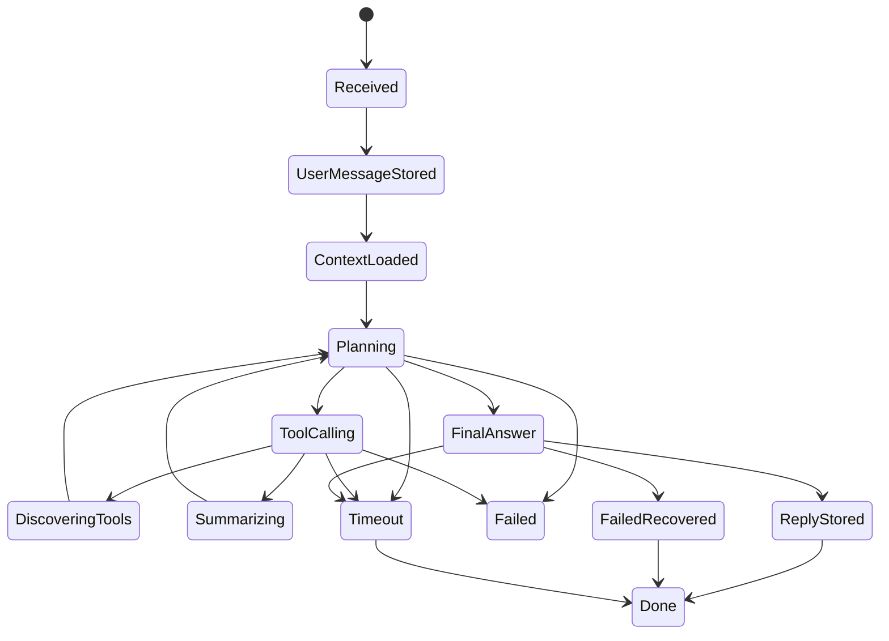
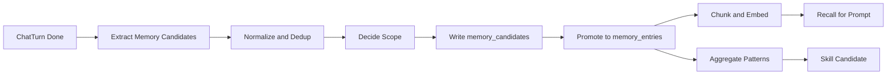
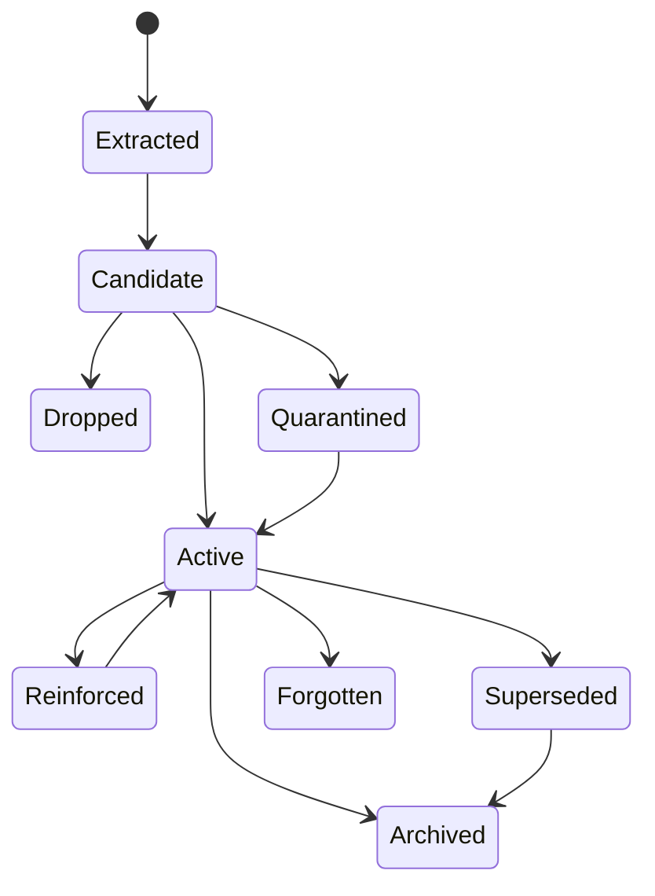

# Chat Turn State And Memory Design

## 目标

这份设计文档回答三个问题：

1. 我们系统里“一段聊天记录”当前是如何流转的。
2. 从现有实现反推，一段聊天记录真正需要哪些字段和关联实体。
3. 基于当前实现，下一轮如何把记忆系统做成可在线召回、可治理、可蒸馏的体系。

本文刻意区分两层：

- `Current`：当前代码和数据库里已经存在的事实。
- `Proposed`：为下一轮演进建议新增或调整的模型。

## 2026-06-04 状态校正

本文最初写于 `ChatTurn` 落库前，下面历史段落里“当前没有独立持久化 Turn 实体”“虽然当前没有 `chat_turns` 表”等判断已经过时。以当前代码为准，`chat_turns`、`chat_turn_events`、`chat_message_projections`、`memory_candidates` 已经落地，新请求链路已能形成 turn 级闭环。

当前事实应改为：

1. `ChatTurn` 已是新请求的一轮执行 aggregate，承接 `request_id / session_id / projection_session_id / workspace_id / status / stage / message_id / tool count / model`。
2. `ChatTurnEvent` 已承接 `stage.*`、`tool.call_*`、`projection.created`、`memory.*` 等事件镜像。
3. `chat_messages.turn_id` 与 `tool_calls.turn_id` 已接入新写入链路，历史数据仍允许为空。
4. `chat_message_projections` 已成为桌面会话主读链路的优先 read model，legacy `chat_messages` 仍作为兜底。
5. `memory_candidates -> memory_entries -> memory_chunks / memory_embeddings -> recall_for_prompt_with_context` 已形成最小闭环，并支持 `workspace_id + path_prefix` 以及带来源元数据的 `session_id / goal_id` 过滤。

仍未完成的目标层：

1. `RecallDoc` 尚未落地，向量索引仍直接围绕 memory chunk 工作。
2. `memory_candidates` 只有 best-effort promotion，尚无独立治理器处理冲突、隔离、supersede 和 skill distillation。
3. 前端实时流仍主要消费 Tauri runtime event；`chat_turn_events` 已可查询，但尚未成为实时 replay 的唯一事实源。
4. 历史 backfill 未完成，当前保证的是新写入链路闭环与混合读取可用。

## Current: 现有聊天系统分层

当前聊天链路不是一个单表模型，而是四层共同组成：

1. `chat_sessions`
   - 会话元数据。
   - 负责 `workspace_id / session_kind / goal_id / archived / title`。

2. `chat_messages`
   - 用户和助手真正可见的消息。
   - 当前每条记录只有 `id / role / content / created_at / seq / tool_calls / session_id / run_id` 这一层级。

3. `active_run`
   - 纯内存运行态。
   - 负责 `request_id / phase / tool_run_count / active_tool_count`。
   - 生命周期只覆盖“正在执行的一轮聊天”。

4. `runtime_events + tool_calls`
   - 事件与工具执行事实层。
   - 负责记录请求尝试、前台焦点变化、工具调用状态、风险级别、耗时等。

因此，当前系统里“聊天记录”其实不是单个 `ChatMessage`。

更准确地说：

- `ChatMessage` 是用户可见输出单元。
- `ChatSession` 是会话容器。
- “一次聊天请求”本质上是一个隐式 `Turn`，但当前没有独立持久化实体。

## Current: 现有表结构与核心实体

### ChatSession

当前 `chat_sessions` 已覆盖这些字段：

- `id`
- `workspace_id`
- `run_id`
- `created_at`
- `title`
- `archived`
- `updated_at`
- `session_kind`
- `goal_id`

当前会话已经出现三种语义：

1. 普通闲聊会话。
2. 绑定 Goal 的用户会话。
3. 内部 `goal-task-exec:*` 执行会话。

### ChatMessage

当前 `ChatMessage` 的 Rust 结构相对轻：

- `id`
- `role`
- `content`
- `created_at`
- `seq`
- `tool_calls`

实际数据库层还隐含关联字段：

- `session_id`
- `run_id`

这意味着当前系统把很多“应该属于消息的数据”放到了别的地方：

- `session_id` 在 DB 里，但不在 `ChatMessage` DTO 里。
- `request_id` 不落库。
- `workspace_id` 依赖 session 间接获得。
- `goal_id / task_id / projection 来源 / 错误态 / 阶段态` 都不在消息自身上。

### ContentBlock

当前消息语义已经不是纯文本，而是结构化 block：

- `text`
- `thinking`
- `tool_use`
- `tool_result`
- `capability_request`
- `plan`
- `completion`
- `blocked`
- `runtime_projection`

但这些 block 目前仍被序列化后塞进 `chat_messages.content: String`。

所以当前系统的真实结构是：

- 存储层：`content: String`
- 语义层：`Vec<ContentBlock>`

### ToolCall

当前 `tool_calls` 已经是比较成熟的事实表，字段包含：

- `id`
- `session_id`
- `workspace_id`
- `llm_tool_call_id`
- `tool_id`
- `input_json`
- `output_json`
- `status`
- `error`
- `started_at`
- `completed_at`
- `duration_ms`
- `agent_run_id`
- `risk_level`
- `proposal_id`
- `permission_grant_id`
- `command_run_id`

这说明“工具层事实”已经比消息层更结构化。

### Memory

当前长期记忆分四张主表：

- `memory_entries`
- `conversation_summaries`
- `memory_chunks`
- `memory_embeddings`

当前能力特点：

1. `memory_entries` 支持 `scope / workspace_id / source / confidence / sensitivity / status`。
2. `conversation_summaries` 存摘要与关键词。
3. `memory_chunks + memory_embeddings` 支持检索和召回。
4. `recall_for_prompt()` 已接入聊天 prompt 构建。
5. 自动摘要会在阈值触发后写入 `conversation_summaries`。

当前限制：

1. `memory_entries` 默认写成 `scope=global, workspace_id=None`。
2. `recall_for_prompt(user_message, None, 5)` 没有传 `workspace_id`。
3. 自动摘要只写“摘要记忆”，没有把 chat turn 抽取成结构化记忆候选。
4. 当前实例里 `memory_entries / conversation_summaries / memory_chunks / memory_embeddings` 都是空表。

## Current: 一次聊天请求的状态流转

建议把“用户发一条消息，系统产生一次回复”的执行过程建模为 `ChatTurn`。

虽然当前没有 `chat_turns` 表，但运行逻辑已经天然是 turn-based。

### 当前隐式状态机



### 当前链路的真实步骤

1. 用户提交消息。
2. `send_message_v2_with_session_projection()` 生成 `request_id`，注册 `active_run`。
3. 用户消息先落 `chat_messages`。
4. 若 session 存在，则尝试自动命名 session。
5. 加载上下文：
   - 最近会话消息
   - 任务快照
   - 当前 workspace
   - 记忆召回
   - 工具定义
6. 进入 LLM turn 循环。
7. 若模型直接返回文本，则进入收尾。
8. 若模型返回 tool calls，则逐个执行工具，工具事实写入 `tool_calls`。
9. 若需要 progressive tool discovery，则扩展工具集并继续下一轮。
10. 若模型迟迟不给最终答案，则强制追问 final answer。
11. 若仍失败，则根据已有 tool 结果合成可审阅 fallback。
12. 最终将 assistant 内容组装成 `ContentBlock[]`，序列化后写回 `chat_messages`。
13. 某些触发点会异步触发自动摘要，写入 `conversation_summaries`。
14. `active_run` 清理，turn 结束。

## Problem: 当前模型的主要缺口

### 1. 没有显式 Turn 实体

当前 turn 的状态散落在：

- `chat_messages`
- `active_run`
- `runtime_events`
- `tool_calls`

结果：

1. 无法稳定查询“一轮聊天从接收、规划、调工具到收尾”的全貌。
2. `request_id` 没有主表归属。
3. 消息状态、工具状态、记忆写回状态无法统一追踪。

### 2. Message 既承担显示，又承担执行归档

当前 assistant message 里混合了：

- 最终用户可见文本
- reasoning 内容
- tool result 摘要
- plan / completion / blocked 等结构块

结果：

1. 存储层 `content: String` 负担过重。
2. message 很难做细粒度 recall、审计和派生。
3. 后续如果要把“结构块”用于不同 UI，很难稳定演进。

### 3. Memory 与 Chat 只做了松耦合

当前只有两条边：

1. prompt 构建时读 memory。
2. auto summarize 时写 `conversation_summaries`。

缺少：

1. turn -> memory candidate
2. message -> memory evidence
3. memory -> message provenance
4. message correction -> memory supersede

### 4. Workspace 粒度只做了一半

当前 schema 已支持 `workspace_id`，但默认写入和 recall 仍偏全局。

这会带来：

1. 项目知识污染全局记忆。
2. 多项目之间召回不干净。
3. 目录/文件级约定无法稳定沉淀。

## Proposed: 新的核心建模

建议把聊天模型拆成 5 个主实体。

### 1. ChatSession

保留当前 session 概念，负责会话级上下文。

```rust
pub struct ChatSessionRecord {
    pub id: String,
    pub workspace_id: Option<String>,
    pub title: String,
    pub session_kind: ChatSessionKind,
    pub goal_id: Option<String>,
    pub active_run_id: Option<String>,
    pub archived: bool,
    pub created_at: DateTime<Utc>,
    pub updated_at: DateTime<Utc>,
    pub last_message_at: Option<DateTime<Utc>>,
    pub metadata: serde_json::Value,
}
```

### 2. ChatTurn

这是下一轮最应该补的一张表。

一轮 turn 对应“一次用户请求及其完整执行”。

```rust
pub enum ChatTurnStatus {
    Received,
    ContextLoaded,
    Planning,
    ToolCalling,
    Summarizing,
    Finalizing,
    ReplyStored,
    Done,
    Failed,
    TimedOut,
    Recovered,
}

pub struct ChatTurnRecord {
    pub id: String,
    pub session_id: String,
    pub workspace_id: Option<String>,
    pub request_id: String,
    pub projection_session_id: Option<String>,
    pub goal_id: Option<String>,
    pub task_id: Option<String>,
    pub user_message_id: Option<String>,
    pub assistant_message_id: Option<String>,
    pub model_provider: String,
    pub model_name: String,
    pub task_mode: String,
    pub capability: String,
    pub plan_only: bool,
    pub status: ChatTurnStatus,
    pub stage: Option<String>,
    pub tool_run_count: u32,
    pub active_tool_count: u32,
    pub timeout_ms: Option<u64>,
    pub started_at: DateTime<Utc>,
    pub finished_at: Option<DateTime<Utc>>,
    pub error: Option<String>,
    pub metadata: serde_json::Value,
}
```

### 3. ChatMessage

消息回归成“显示单元”，但必须补足归属。

```rust
pub enum ChatMessageStatus {
    Draft,
    Visible,
    Superseded,
    Hidden,
    FailedProjection,
}

pub struct ChatMessageRecord {
    pub id: String,
    pub session_id: String,
    pub turn_id: Option<String>,
    pub workspace_id: Option<String>,
    pub role: ChatRole,
    pub author_kind: String,
    pub author_id: Option<String>,
    pub seq: i64,
    pub content_format: String,
    pub plain_text: Option<String>,
    pub content_blocks_json: serde_json::Value,
    pub bubble_summary: Option<String>,
    pub status: ChatMessageStatus,
    pub parent_message_id: Option<String>,
    pub projection_source_session_id: Option<String>,
    pub goal_id: Option<String>,
    pub task_id: Option<String>,
    pub created_at: DateTime<Utc>,
    pub updated_at: DateTime<Utc>,
    pub metadata: serde_json::Value,
}
```

关键点：

1. `content_blocks_json` 成为一等字段，不再只塞到 `content: String`。
2. `plain_text` 作为检索和预览辅助字段。
3. `turn_id` 把 message 接回执行事务。
4. `projection_source_session_id` 支持 goal 执行会话向用户会话投影。

### 4. ToolCall

当前 `tool_calls` 已经比较好，建议只补 `turn_id / message_id`。

```rust
pub struct ChatToolCallRecord {
    pub id: String,
    pub turn_id: String,
    pub session_id: String,
    pub message_id: Option<String>,
    pub workspace_id: Option<String>,
    pub llm_tool_call_id: Option<String>,
    pub tool_id: String,
    pub input_json: serde_json::Value,
    pub output_json: Option<serde_json::Value>,
    pub status: String,
    pub risk_level: Option<String>,
    pub error: Option<String>,
    pub started_at: DateTime<Utc>,
    pub completed_at: Option<DateTime<Utc>>,
    pub duration_ms: Option<u64>,
}
```

### 5. MemoryCandidate / MemoryEntry

建议把“候选记忆”和“已确认记忆”拆开。

```rust
pub enum MemoryCandidateStatus {
    Extracted,
    Deduped,
    Promoted,
    Dropped,
    Quarantined,
}

pub struct MemoryCandidate {
    pub id: String,
    pub turn_id: String,
    pub message_id: String,
    pub session_id: String,
    pub workspace_id: Option<String>,
    pub producer_kind: String,
    pub producer_id: Option<String>,
    pub scope_hint: String,
    pub memory_type: String,
    pub key: String,
    pub value: String,
    pub confidence: f64,
    pub evidence_json: serde_json::Value,
    pub status: MemoryCandidateStatus,
    pub created_at: DateTime<Utc>,
}
```

## Proposed: 一段聊天记录应包含的字段

如果用户说的“一段聊天记录”指的是可持久化、可追踪、可用于记忆的最小业务对象，我建议它至少包含以下字段。

### 最小必需字段

- `message_id`
- `session_id`
- `turn_id`
- `workspace_id`
- `role`
- `seq`
- `content_format`
- `content_blocks_json`
- `plain_text`
- `created_at`
- `updated_at`

### 运行归属字段

- `request_id`
- `goal_id`
- `task_id`
- `projection_source_session_id`
- `author_kind`
- `author_id`

### 执行结果字段

- `status`
- `bubble_summary`
- `tool_call_count`
- `has_error`
- `error_summary`

### 记忆与检索字段

- `memory_eligible`
- `memory_scope_hint`
- `content_hash`
- `embedding_needed`
- `language`
- `sensitivity`

### 推荐最终形态

一句话总结：

- `ChatMessage` 应该面向显示。
- `ChatTurn` 应该面向执行事务。
- `MemoryCandidate` 应该面向抽取与治理。

## Proposed: 记忆系统详细设计

### 设计目标

记忆系统要同时满足 6 个目标：

1. 在线召回：聊天时能带回真正相关的上下文。
2. 分层隔离：全局、项目、目录、文件不能混。
3. 可审计：知道每条记忆从哪段对话、哪个模型、哪个工具而来。
4. 可修正：错误记忆能被隔离、替换、遗忘。
5. 可蒸馏：高频稳定模式能升级为 skill。
6. 可控噪：不是每条聊天都直接变长期记忆。

### 1. 记忆分层

建议统一成 5 层：

1. `global`
   - 用户稳定偏好、跨项目习惯、长期身份信息。

2. `workspace`
   - 项目结构、运行方式、技术栈、团队约定。

3. `path`
   - 某目录约定、某子系统边界、局部命令。

4. `document`
   - 单文件特有事实，如某文档的口径、某配置文件的约束。

5. `session`
   - 当前会话短期上下文，可衰减，不默认长期保留。

当前代码已有：

- `global`
- `workspace`
- `document`
- `session`

但缺 `path` 这一层，而你现在的问题非常适合把 `path` 补出来。

### 2. 记忆写入流水线

建议下一轮采用如下流水线：



### 3. 记忆来源类型

建议扩展 `source` 为两层：

1. `memory_source`
   - `user_confirmed`
   - `tool`
   - `inferred`
   - `summary`
   - `pattern_aggregation`

2. `producer`
   - `producer_kind`: `user | llm | tool | system`
   - `producer_id`: 具体 backend/model/tool/agent

这样能回答：

- 是谁写的这条记忆。
- 它是用户确认事实，还是模型推断。

### 4. 记忆状态机

建议把当前状态机扩成更完整版本：



状态定义：

- `candidate`
  - 新抽取，未确认，默认不强召回。

- `active`
  - 已确认，可召回。

- `reinforced`
  - 不是独立状态，建议体现在分数和计数上。

- `quarantined`
  - 发现可疑，召回时默认排除。

- `superseded`
  - 被新版本替代，但保留审计链。

- `forgotten`
  - 用户或系统明确遗忘。

- `archived`
  - 不再参与主动召回，但保留历史。

### 5. 记忆抽取策略

不是每条聊天都值得进长期记忆。

建议只抽以下 5 类：

1. 用户明确偏好
   - “我更喜欢 Rust 而不是 Python”
   - “以后报告都按这个结构写”

2. 项目稳定事实
   - “这个仓库用 Tauri + Rust”
   - “运行入口是 `cargo run -p ...`”

3. 长期任务约束
   - “这个 Goal 需要先红队后蓝队，再主线程汇总”

4. 文件/目录规则
   - “`apps/desktop` 属于 UI 层，`crates/conductor-core` 是核心状态机”

5. 用户确认后的结论
   - “这版方案就按 workspace 粒度推进”

默认不抽：

1. 普通寒暄。
2. 一次性过程性思考。
3. 未经确认的模型猜测。
4. 临时工具输出原文。

### 6. 与聊天链路的接线点

建议在 4 个点接 memory：

1. `Turn Start`
   - 按 `workspace_id + path + session_kind` 做 recall。

2. `Tool Done`
   - 对高价值工具结果做候选记忆抽取。

3. `Assistant Reply Stored`
   - 从最终结果里提炼“用户确认结论”。

4. `Turn Done`
   - 异步写 `memory_candidates`，不要阻塞聊天主链路。

### 7. recall 设计

下一轮 recall 不应再用 `recall_for_prompt(user_message, None, 5)`。

建议改成：

```rust
pub struct RecallContext {
    pub query: String,
    pub workspace_id: Option<String>,
    pub path: Option<String>,
    pub session_id: Option<String>,
    pub goal_id: Option<String>,
    pub limit: usize,
}
```

召回顺序建议：

1. `workspace + path` 精准召回
2. `workspace` 级召回
3. `global` 偏好召回
4. `session` 近期摘要召回

并做预算控制：

- preference 2-3 条
- workspace facts 3-5 条
- path/document facts 1-3 条
- recent summaries 1-2 条

### 8. conversation summary 的改造

当前 `conversation_summaries` 太轻，只存：

- `id`
- `summary`
- `keywords`
- `timestamp`

建议补：

- `session_id`
- `workspace_id`
- `start_seq`
- `end_seq`
- `summary_kind`
- `source_turn_id`
- `model_name`
- `prompt_version`

这样摘要才能真正作为 message span 的压缩索引，而不是孤立文本。

### 9. skill 蒸馏

记忆不应直接变 skill。

建议中间多一层：

- `memory_patterns`
- `skill_candidates`

流程：

1. 从 `active` 记忆里找高频模式。
2. 只有跨多轮、跨时段仍稳定的模式才生成 `skill_candidate`。
3. 由用户或系统确认后，才写入 `skill_packages`。

适合蒸馏的模式：

1. 固定评审流程
2. 项目特定分析套路
3. 可复用执行模板

不适合蒸馏的模式：

1. 临时事实
2. 单次讨论结论
3. 不稳定路径细节

## Schema 变更建议

### 优先级 P0

1. 新增 `chat_turns`
2. `chat_messages` 增加：
   - `turn_id`
   - `workspace_id`
   - `content_format`
   - `plain_text`
   - `content_blocks_json`
   - `updated_at`
   - `status`
   - `bubble_summary`
3. `tool_calls` 增加：
   - `turn_id`
   - `message_id`
4. `conversation_summaries` 增加：
   - `session_id`
   - `workspace_id`
   - `start_seq`
   - `end_seq`

### 优先级 P1

1. 新增 `memory_candidates`
2. `memory_entries` 增加：
   - `producer_kind`
   - `producer_id`
   - `source_session_id`
   - `source_turn_id`
   - `source_message_id`
   - `path`
   - `document_uri`
   - `content_hash`
   - `supersedes_memory_id`

### 优先级 P2

1. 新增 `memory_links`
2. 新增 `memory_recall_log`
3. 新增 `memory_patterns`
4. 新增 `skill_candidates`

## 推荐落地顺序

### Phase 1

先把聊天事务模型补齐。

1. 新建 `chat_turns`
2. 所有发送链路都写 `turn_id`
3. 把 `request_id / phase / tool count / outcome` 固化到 turn

### Phase 2

把消息结构从“字符串 content”升级成“双轨存储”。

1. 保留 `content` 兼容旧版本
2. 新增 `content_blocks_json + plain_text`
3. 前端逐步切到结构化消费

### Phase 3

把记忆抽取从“摘要驱动”升级成“turn 驱动”。

1. 新增 `memory_candidates`
2. 对 user/assistant/tool 结果做抽取
3. 引入 workspace/path 作用域决策

### Phase 4

把 recall 从全局改为分层召回。

1. prompt 构建时传入 `workspace_id`
2. 再补 `path/document`
3. 做 recall budget 和冲突消解

### Phase 5

做 pattern aggregation 和 skill distillation。

## 最终结论

当前系统已经具备：

1. 会话容器
2. 结构化内容块
3. 工具执行事实
4. 自动摘要
5. 基础记忆召回

但它还缺少一个明确的中枢实体：`ChatTurn`。

所以我建议下一轮的核心不是继续扩 `ChatMessage`，而是：

1. 先引入 `ChatTurn`
2. 再把 `Message / ToolCall / MemoryCandidate` 都挂到 `Turn`
3. 再让 `Memory` 真正按 `workspace/path` 分层
4. 最后才做 `memory -> skill` 蒸馏

一句话概括：

- 当前系统已经有“聊天消息”和“记忆表”。
- 下一轮要补的是“聊天事务”和“记忆治理层”。
