# 当前架构说明：Conductor 桌宠、工具、记忆与工作区

> 日期：2026-05-26
> 目标：说明当前系统真实架构，并用流程图展示用户进入后的主要操作路径。

## 1. 架构总览

Conductor 当前是一个 Tauri 桌面应用，前端负责桌宠窗口、任务面板、对话面板和设置面板；Rust 后端负责感知、任务、提案、工具执行、记忆、形象切换和 SQLite 持久化。

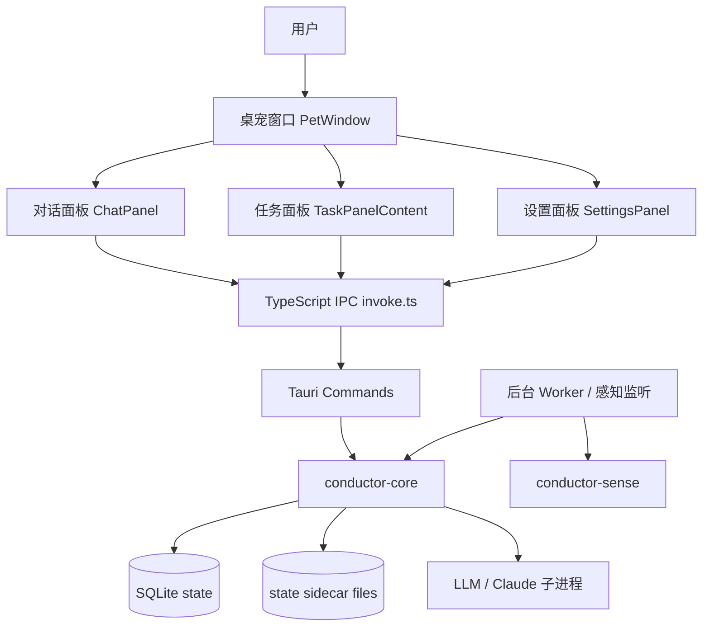

核心分层：

- 前端层：`apps/desktop/src/windows/*`、`apps/desktop/src/ipc/invoke.ts`。
- Tauri 命令层：`apps/desktop/src-tauri/src/commands.rs`。
- 后台感知层：`apps/desktop/src-tauri/src/worker.rs`、`conductor-sense`（焦点/空闲检测）。
- 核心业务层：`crates/conductor-core/src/*`：
  - `chat.rs` — 对话 + LLM 调用 + 工具循环
  - `expression.rs` — 情绪状态机 (7 MoodZone, PAD 模型, 60s 衰减)
  - `affection.rs` — 好感度系统 (5 关系阶段, 迟滞, 每日衰减)
  - `persona.rs` — 人格特质 + prompt 模板 (已注入 system prompt)
  - `smart_monitor.rs` — LLM 驱动的智能监控决策器
  - `initiative.rs` — 主动触发引擎 (文档/编码/事件/时间)
  - `memory.rs` — 记忆系统 (fastembed BGE-small-en-v1.5 向量搜索)
  - `llm.rs` — LLM 调用 (OpenAI 兼容 / Anthropic 兼容)
  - `tools.rs` — 工具注册与执行
  - `tasks.rs` — 任务管理
- CLI/Hook 层：`crates/conductor-cli/src/main.rs`。
- 持久化层：SQLite 表（chat_messages, tasks, mood_state, affection_state, memory_chunks）和 sidecar 文件。

## 2. 用户进入后的操作流程

### 2.1 启动与桌宠进入

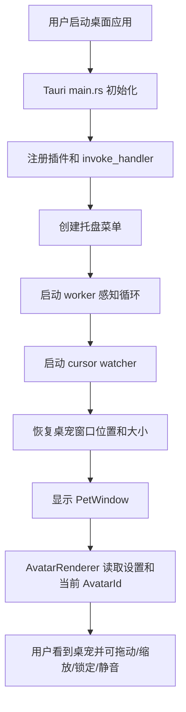

关键代码：

- `apps/desktop/src-tauri/src/main.rs`
- `apps/desktop/src-tauri/src/worker.rs`
- `apps/desktop/src/windows/PetWindow.tsx`
- `apps/desktop/src/windows/AvatarRenderer.tsx`

### 2.2 用户打开面板

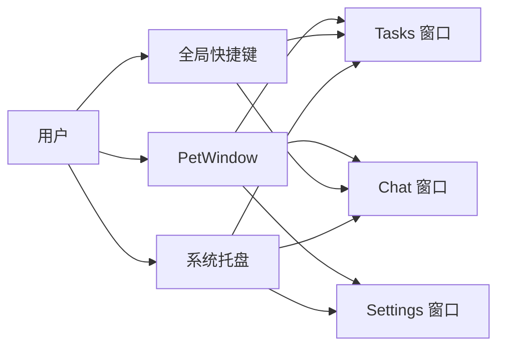

当前快捷键：

- `CmdOrCtrl+Shift+L`: 打开任务面板。
- `CmdOrCtrl+Shift+C`: 打开对话面板。
- 专注模式通过托盘菜单触发（无快捷键）。

## 3. 对话路径

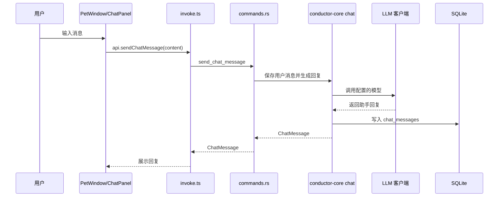

当前特点：

- PetWindow 可直接发送轻量消息。
- ChatPanel 读取历史并发送完整对话。
- chat 历史落入 SQLite。
- 回复失败时前端只展示简短错误，不阻断桌宠窗口。

## 4. 任务与提案路径

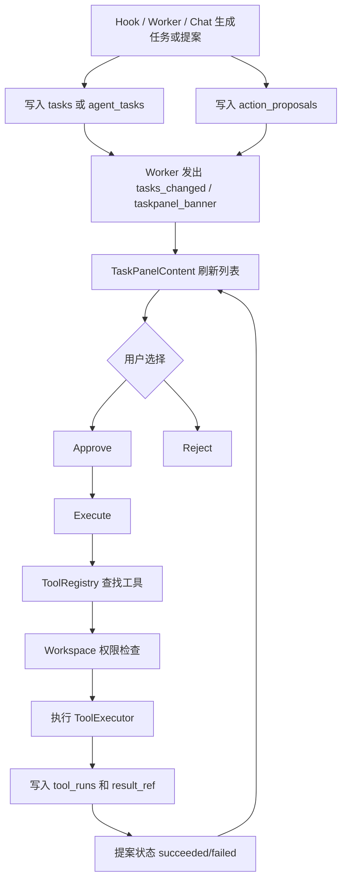

提案状态机：

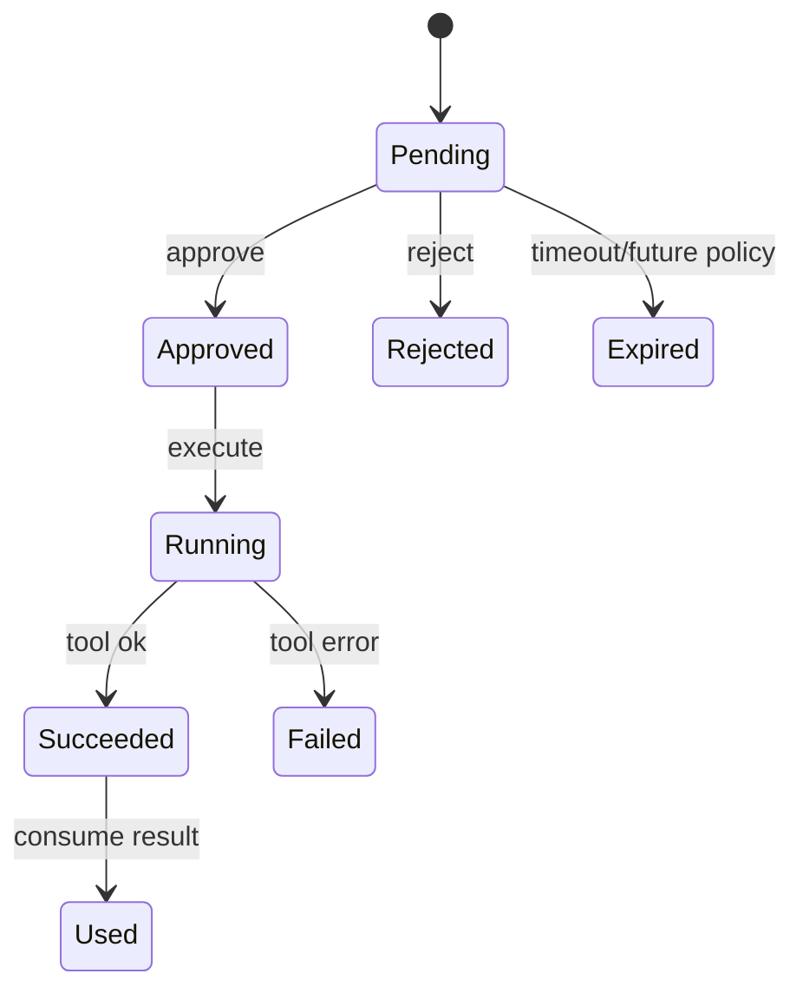

关键代码：

- `crates/conductor-core/src/proposals.rs`
- `crates/conductor-core/src/tools.rs`
- `apps/desktop/src/windows/TaskPanelContent.tsx`
- `apps/desktop/src-tauri/src/commands.rs`

## 5. 工具执行架构

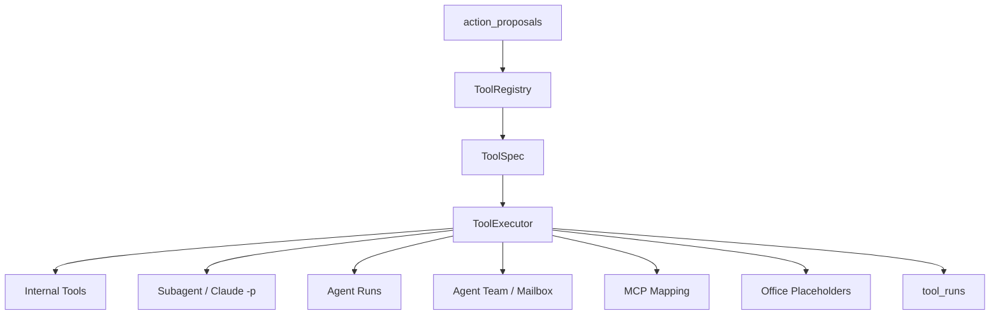

当前工具 provider 的真实边界：

- `internal`: demo、task、avatar、tool.search 等已可用。
- `subagent`: `subagent.claude_p` 可同步调用。
- `agent`: `agent.start/read_output/stop` 可用，但长跑由宿主进程托管。
- `team/mailbox`: 轻量持久化可用，不含自动调度。
- `mcp`: mapping/discovery scaffolding 已有，远程 execute 仍待完善。
- `office`: 只有只读/预览占位，没有真实 `office-cli`。

## 6. Workspace 权限路径

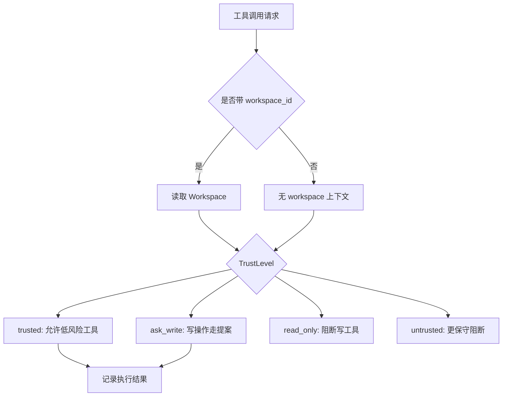

当前工作区的产品表达仍应是“当前项目/当前文档/当前上下文”，不要暴露成“每个目录都有一个桌宠副本”。

## 7. 记忆架构

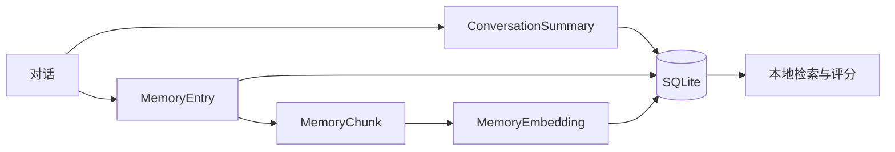

当前实现：

- SQLite 是事实源。
- 对话摘要、用户偏好、工作区记忆可持久化。
- 检索为本地轻量/伪 embedding + 多维评分。

未实现：

- 真正的 embedding provider。
- 记忆可视化管理。
- 敏感记忆审批和过期策略。

## 8. 形象与主动提示路径

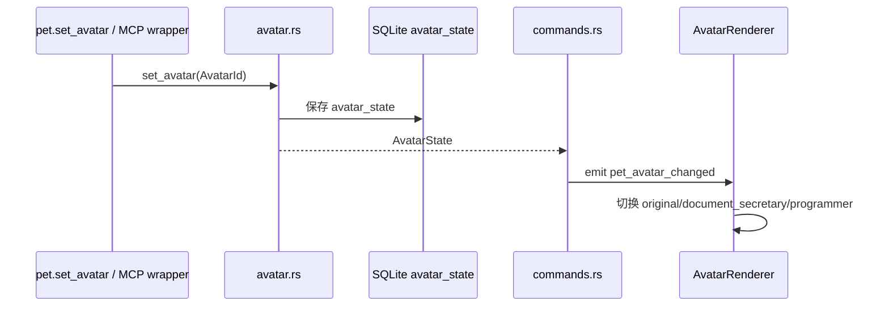

主动提示路径：

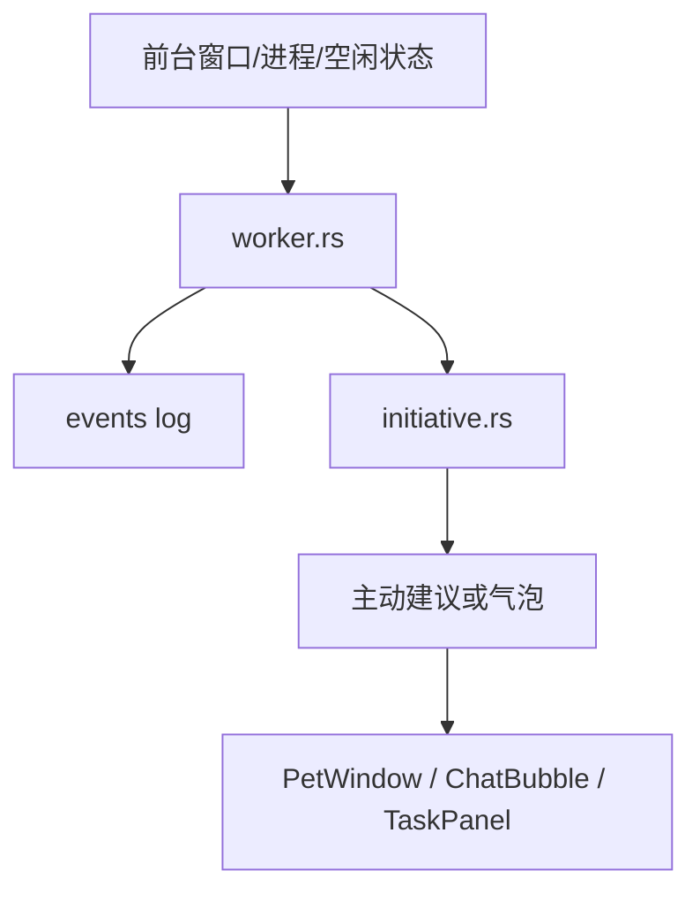

## 9. Agent Run 与 Team 路径

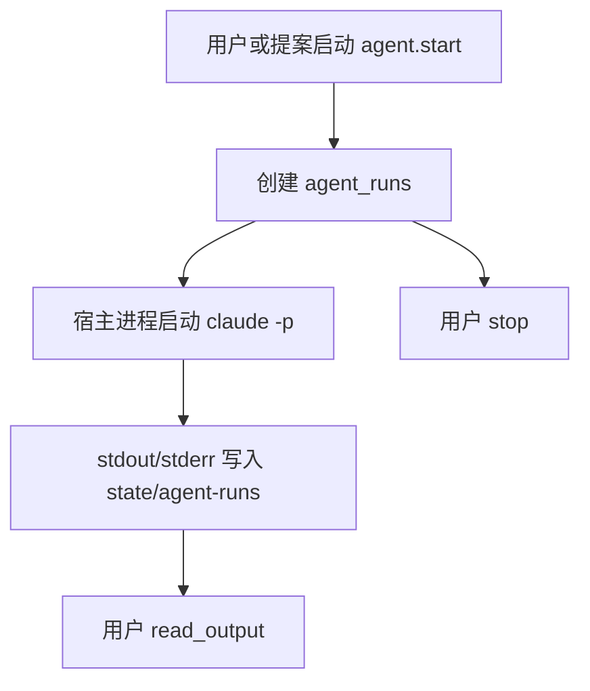

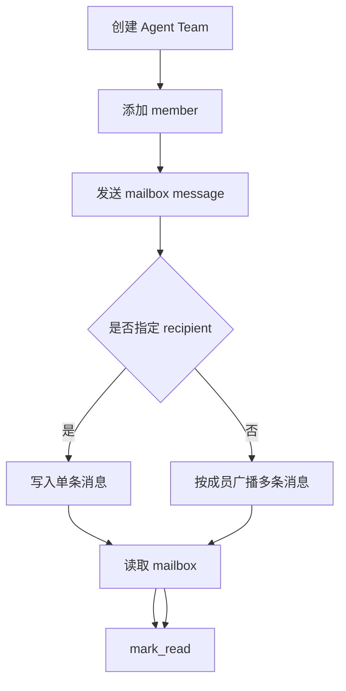

当前边界：

- Agent Team 是轻量容器和 mailbox。
- 不负责自动调度、远程执行或跨进程协作。

## 10. 当前最关键的未完成架构点

1. Office real provider：把 `office.*` 从占位替换为真实 `office-cli` 或其他可靠文档解析工具。
2. Worktree sandbox：高风险文件修改先进入临时副本。
3. Agent daemon：把长跑 agent 从宿主进程托管升级为可恢复 worker。
4. Proposal preview UI：展示 dry-run 输出、风险、workspace、工具输入。
5. Memory governance：记忆查看、删除、敏感标记、过期策略。
6. MCP runtime：补齐 provider client、远程调用、连接状态和错误映射。
